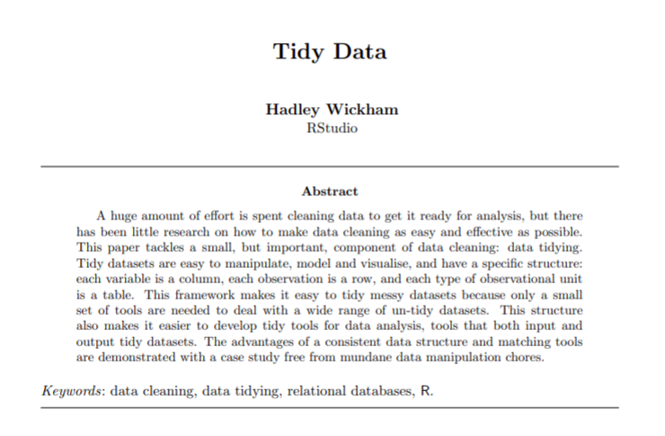
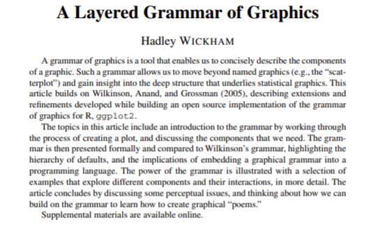
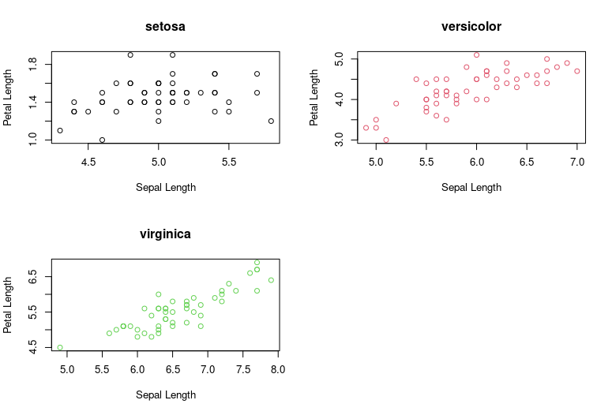
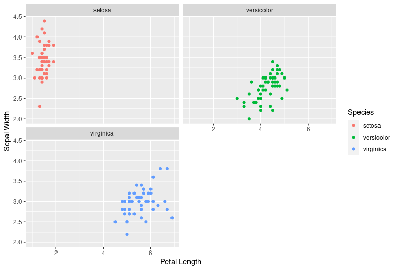

# Motivation: why tidy

handling data in R is ...bad... sometimes

<br/>

```r
mtcars$newcol <- mtcars$mpg * mtcars$cyl
mtcars["newcol"] <- mtcars["mpg"] * mtcars["cyl"]
```

<div class = "run-r"></div>

<br/>

- Why do we have to write "mtcars" so many times?
- How do you say this in English?
- Why are there two syhmbols for the same thing?
- Why do you have to quote it in one context and unquote it in another?

---

# Then: Hadley Wickham

<div class="img-container">
  
</div>

---

# Then: Hadley Wickham and his 2014 paper

<div class="img-container">
  
</div>

[accessible here](https://vita.had.co.nz/papers/tidy-data.pdf)

---

# An extension: tidy _code_ too

- Tidy data is important, but for data scientists it's almost impossible to have
  tidy data without tidy code
- What kind of logic can we have with code to make it more human-readable?

Enter dplyr and ggplot2: a "grammar of data manipulation" and a "grammar of
graphics"

---

# dplyr: basic ideas

- Six verbs
  - `mutate`: change values of a column
  - `select`: pick certain columns
  - `filter`:pick certain rows
  - `summarize`: combine many rows together
  - `arrange`: reorder rows
- one adverb: `group_by`
- one conjunction: the pipe (`%>%`)
- Usually one "subject": your dataset

To make this grammar work, all verbs in dplyr _receive_ a dataframe as their
first argument and also _return_ a dataframe.

<br/>

To code in regular R, you need to know code.

To code in dplyr R, you need to know english.

---

# dplyr: comparison

_Task_: From the `iris` dataset of flowers, find which species of color has the
longest average petal width.

Without dplyr:

```r
avg_widths <- NULL
names(avg_widths) <- unique(iris$Species)
for(species in unique(iris$Species)){
  species_data <- iris[iris$Species == species,]
  avg_widths <- mean(species_data$Petal.Width)
}
max(avg_widths)
max(tapply(iris$Petal.Width, iris$Species, mean))
```

With:

<pre>
  <code data-line-numbers="1|2|3|4"> iris %>%
  group_by(Species) %>%
  summarize(avg_petal_width = mean(Petal.Width)) %>% 
  arrange(avg_petal_width)  
  </code>
</pre>

---

# A similar idea: ggplot2

Literally in the name: a _grammar of graphics_

<div class="img-container">
  
</div>

---

# ggplot2 and the grammar of graphics

Any data graphic can be thought of as composed of a few different layers:

- a frame
- a glyph, or a `geom`
- scales
- facets
- theme

To make a plot in base R, you need to think about code. To code in ggplot2, you
need to think about graphics.

---

# ggplot2: a comparison

_Task_: make three scatter plots of flowers on the same grid from the `iris`
dataset, with `Petal.Length` on the y-axis and `Sepal.Width` on the x-axis.

```r
par(mfrow = c(2,2))
colors <- c("red", "blue", "green")
for(i in 1:length(unique(iris$Species))){
  color <- colors[i]
  species <- unique(iris$Species)[i]
  species_df <- iris[iris$Species == species,]
  plot(species_df$Sepal.Length, species_df$Petal.Length,
       col = species,
       main = species, ylab = "Petal Length", xlab = "Sepal Length")
}
```

<pre>
  <code data-line-numbers="1|2|3|4">ggplot(iris, aes(x = Petal.Length, Sepal.Width, color = Species)) + 
    geom_point() +
    facet_wrap(~Species, nrow = 2) + 
    labs(x = "Petal Length", y = "Sepal Width")
  </code>
</pre>

---

# comparison

<div class="img-container">
  
    
</div>

---

# Summary

- By providing a conceptual framework where all code has its own sensible place,
  you can drastically reduce the mental power it takes to write code
- This is undeniably a little hard to learn at first, because there's a lot of
  new concepts thrown at you at once, but it opens the door to so many
  possibilities because it defines generic ways to combine and recombine plots
  and analysis functions

<div class = "run-r"></div>
